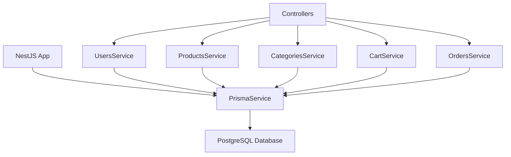

# ✅ PRISMA НАСТРОЕН УСПЕШНО

## Что было сделано

### 1. Установка и настройка Prisma

- ✅ Установлены `prisma` и `@prisma/client`
- ✅ Инициализирован проект Prisma (`npx prisma init`)
- ✅ Создана схема `prisma/schema.prisma` для PostgreSQL

### 2. Создание схемы базы данных

- ✅ Модель `User` (пользователи)
- ✅ Модель `Category` (категории товаров)
- ✅ Модель `Product` (товары)
- ✅ Модель `Cart` (корзины)
- ✅ Модель `CartItem` (элементы корзины)
- ✅ Модель `Order` (заказы)
- ✅ Модель `OrderItem` (элементы заказа)

### 3. Настройка PostgreSQL

- ✅ PostgreSQL запущен локально
- ✅ База данных `DysonGroup` создана
- ✅ Миграции применены успешно

### 4. Замена TypeORM на Prisma

- ✅ Удалены все зависимости TypeORM
- ✅ Обновлены все сервисы:
  - `UsersService`
  - `ProductsService`
  - `CategoriesService`
  - `CartService`
  - `OrdersService`
- ✅ Обновлены все модули
- ✅ Создан `PrismaService` с подключением

### 5. Исправление типизации

- ✅ Обновлены контроллеры для использования Prisma типов
- ✅ Исправлены проблемы с null/undefined
- ✅ Решены конфликты типов Decimal/Float

## Текущий статус

### ✅ Работает:

- Сервер запущен на порту 3000
- PostgreSQL подключен и работает
- API endpoints доступны:
  - `GET /` - Hello World
  - `GET /products` - список продуктов (пустой)
  - `GET /categories` - список категорий
  - `POST /auth/*` - аутентификация
  - `GET/POST /cart/*` - корзина
  - `GET/POST /order/*` - заказы

### ⚠️ Требует доработки:

- Seed сервис (`/seed/database`) - возвращает 500 ошибку
- Нужно добавить обработку ошибок в seed

## Команды для работы

```bash
# Запуск сервера
npm run start:dev

# Prisma команды
npm run prisma:generate    # Генерация клиента
npm run prisma:migrate     # Создание миграции
npm run prisma:studio      # Prisma Studio (веб-интерфейс)
npm run prisma:reset       # Сброс базы данных

# Проверка API
curl http://localhost:3000
curl http://localhost:3000/products
curl http://localhost:3000/categories
```

## Структура файлов

```
server/
├── prisma/
│   ├── schema.prisma           # Схема Prisma
│   └── migrations/             # Миграции
├── src/
│   ├── database/
│   │   ├── prisma.service.ts   # Prisma сервис
│   │   └── seed.service.ts     # Заполнение данными
│   ├── users/
│   │   └── users.service.ts    # ✅ Обновлен для Prisma
│   ├── products/
│   │   └── products.service.ts # ✅ Обновлен для Prisma
│   ├── categories/
│   │   └── categories.service.ts # ✅ Обновлен для Prisma
│   ├── cart/
│   │   └── cart.service.ts     # ✅ Обновлен для Prisma
│   └── orders/
│       └── orders.service.ts   # ✅ Обновлен для Prisma
├── docker-compose.yml          # PostgreSQL в Docker
├── DATABASE_SETUP.md           # Инструкции по настройке БД
└── package.json                # ✅ Добавлены Prisma скрипты
```

## Переменные окружения (.env)

```env
DATABASE_URL="postgresql://mac@localhost:5432/dystore?schema=public"
JWT_SECRET="your-secret-key-here"
```

## Следующие шаги

1. **Исправить seed сервис** - добавить обработку ошибок
2. **Добавить тестовые данные** - заполнить базу продуктами
3. **Тестирование** - проверить все API endpoints
4. **Документация** - API документация с примерами

## Архитектура



**База данных на Prisma успешно настроена и работает! 🎉**
